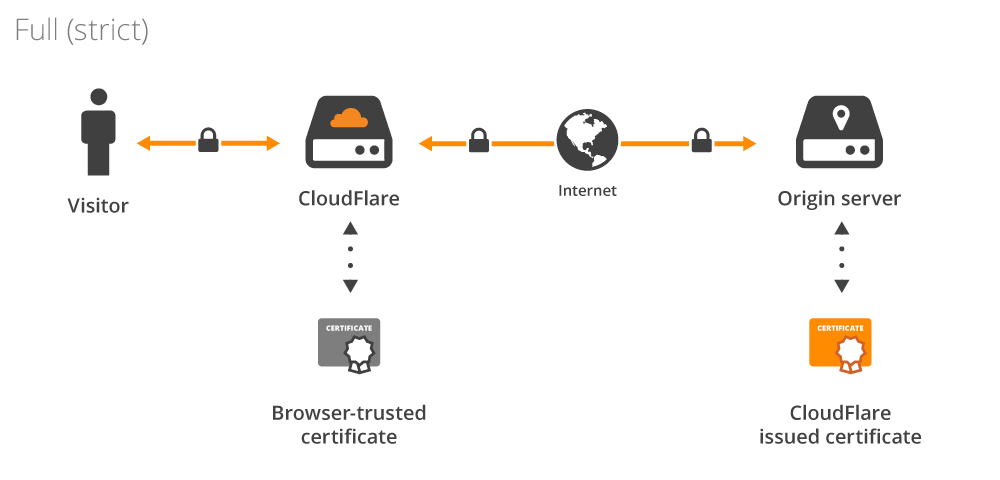

# Deployment guides

This directory contains deployment guides for running Expose server with fully valid SSL certificates using Cloudflare.

- Create a Cloudflare account
- Add a domain to Cloudflare
- Add Proxied DNS Record of your naked domain, e.g.: `sharedwithexpose.localhost`
- Add Proxied DNS Record of your `expose` subdomain, e.g.: `expose.sharedwithexpose.localhost`
- Add Proxied wildcard DNS Record of your domain, e.g.: `*.sharedwithexpose.localhost`
- Create a Cloudflare Origin Certificate and download it
- Deploy Expose server with all your necessary configuratio

**Overview:**


## Docker Stack
Example `docker-stack.yml`:

```yaml
# yaml-language-server: $schema=https://raw.githubusercontent.com/swarmlibs/dockerstack-schema/main/schema/dockerstack-spec.json

services:
  ingress:
    image: caddy:2.8-alpine
    environment:
      EXPOSE_INGRESS_DOMAIN: ${EXPOSE_INGRESS_DOMAIN}
      EXPOSE_INGRESS_TLS_PROVIDER: ${EXPOSE_INGRESS_TLS_PROVIDER}
    ports:
      - mode: host
        target: 80
        published: 80
      - mode: host
        target: 443
        published: 443
    networks:
      expose-network:
    configs:
      - source: ingress_config
        target: /etc/caddy/Caddyfile
    secrets:
      - source: ingress_cf_origin_server.crt
        target: /run/secrets/cf_origin_server.crt
      - source: ingress_cf_origin_server.key
        target: /run/secrets/cf_origin_server.key
  expose:
    image: socheatsok78/expose:main
    environment:
      EXPOSE_SERVER_DOMAIN: ${EXPOSE_SERVER_DOMAIN}
      EXPOSE_SERVER_PORT: ${EXPOSE_SERVER_PORT}
      EXPOSE_CONFIG_SERVER_ENDPOINT_URL: ${EXPOSE_CONFIG_SERVER_ENDPOINT_URL}
      EXPOSE_SERVER_ADMIN_USERNAME_FILE: /run/secrets/expose_server_admin_username
      EXPOSE_SERVER_ADMIN_PASSWORD_FILE: /run/secrets/expose_server_admin_password
    networks:
      expose-network:
    hostname: expose.internal
    volumes:
      - type: volume
        source: expose-data
        target: /root/.expose
    secrets:
      - expose_server_admin_username
      - expose_server_admin_password
volumes:
  expose-data:
networks:
  expose-network:
configs:
  ingress_config:
    file: ./Caddyfile
secrets:
  ingress_cf_origin_server.crt:
    file: ./certs/cf_origin_server.crt
  ingress_cf_origin_server.key:
    file: ./certs/cf_origin_server.key
  expose_server_admin_username:
    file: ./secrets/expose_server_admin_username
  expose_server_admin_password:
    file: ./secrets/expose_server_admin_password
```

Example `Caddyfile`:

```caddy
{
	auto_https disable_redirects
	servers :80 {
		name http
		metrics
	}
	servers :443 {
		name https
		metrics
	}
	log default {
		output stdout
		format json
	}
}
(commons) {
	header {
		-Server
	}
	request_body {
		max_size 16MB
	}
	@skip path_regexp \.(js|css|svg|png|jpe?g|gif|ico|woff|otf|ttf|eot|svg|txt?)$
	log
	log_skip @skip
}
(tls-internal) {
	tls internal
}
(tls-cloudflare) {
	tls {$CLOUDFLARE_ORIGIN_CERT_FILE:/run/secrets/cf_origin_server.crt} {$CLOUDFLARE_ORIGIN_KEY_FILE:/run/secrets/cf_origin_server.key}
}
http:// {
	import commons
	reverse_proxy expose.internal
}
https:// {
	import commons
	import tls-{$EXPOSE_INGRESS_TLS_PROVIDER:internal}
	reverse_proxy expose.internal
}
{$EXPOSE_INGRESS_DOMAIN:sharedwithexpose.localhost}, *.{$EXPOSE_INGRESS_DOMAIN:sharedwithexpose.localhost} {
	reverse_proxy expose.internal
}
:9191 {
	metrics /metrics
}
```
