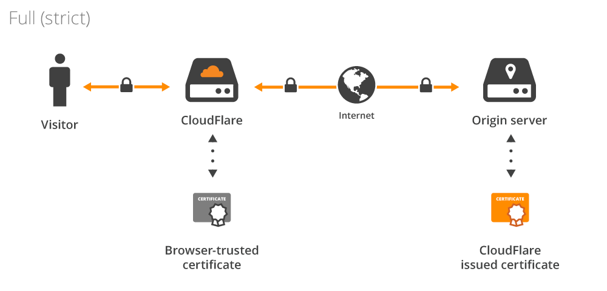

# Setup and configure a server

> [!IMPORTANT]
> This guide uses Cloudflare to issue SSL certificates for your domain for simplicity sake, since configure Caddy to generate wildcard certificates requires a bit more work. If you want to use Caddy to generate wildcard certificates, please refer to the official Caddy documentation.

- Create a Cloudflare account
- Add a domain to Cloudflare
- Add Proxied DNS Record of your naked domain, e.g.: `sharedwithexpose.localhost`
- Add Proxied DNS Record of your `expose` subdomain, e.g.: `expose.sharedwithexpose.localhost`
- Add Proxied wildcard DNS Record of your domain, e.g.: `*.sharedwithexpose.localhost`
- Create a Cloudflare Origin Certificate and download it
- Deploy Expose server with all your necessary configurations
